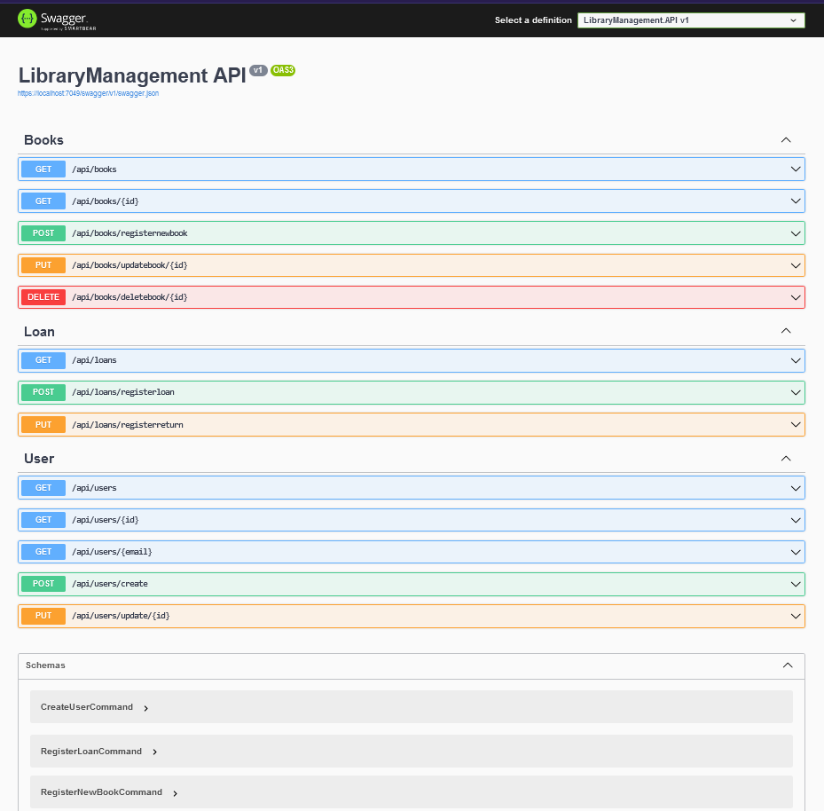

## API for Library Management 🖥

#### *LibraryManagement was developed with clean architecture, repository pattern and CQRS.* 
#### *LibraryManagement has the purpose to offer a simple platform for management of books, users and loans.* 

### Technologies ⌨
- ASP.NET Core 8
- Entity Framework Core
- Server in memory with EF
- MediatR 

### Functionalities ⚙
- CRUD (Create, Read, Update, Delete) of Books.
- CRUD (Create, Read, Update, Delete) of Users.
- Loan registration and status update.
- Book status: avaliable, borrowed
- Search by book id, by user id and e-mail, etc

### Patterns, concepts and architecture 📂
- Repository pattern
- Clean Architecture
- CQRS

### Upcoming 💡
- Authentication and Authorization with JWT Bearer
- Unity tests: XUnit
- Fluent Validation para validação de API

## Photos 📷

End Point Screen: 

<a href="https://www.linkedin.com/in/caiopgaspar/">Caio Henrique Pessoa Gaspar</a>
